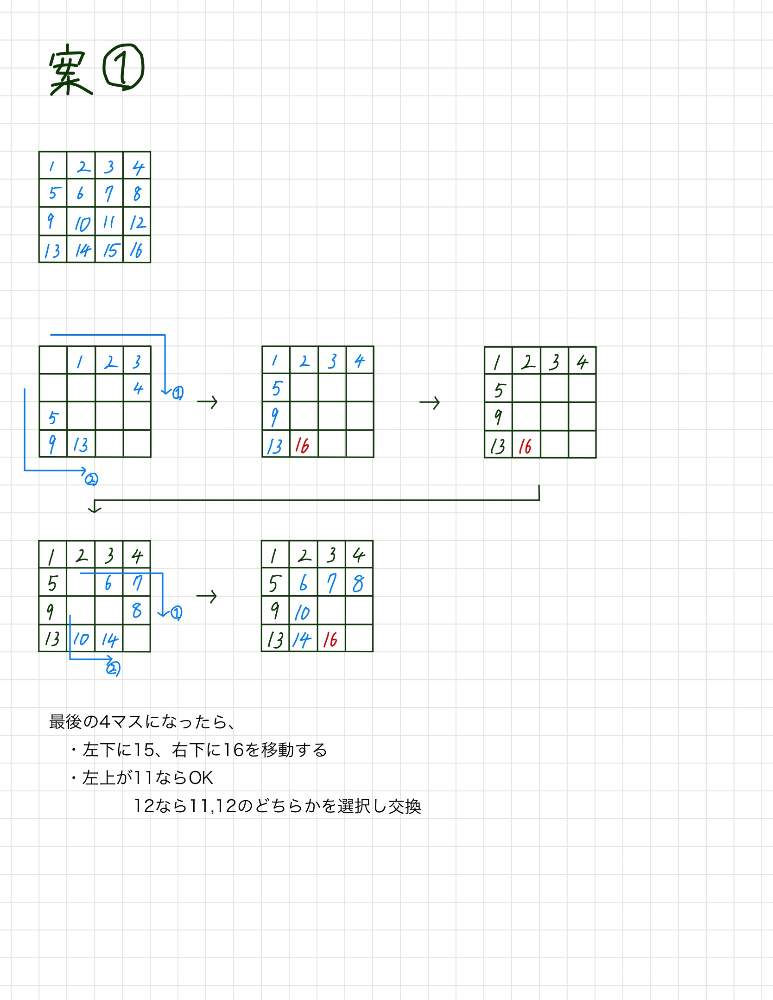

# joboji_campus

テーマ:画像処理

## 4/28
githubの設定  
clone,commit,pushできたことを確認  

## 5/12
選択回数 : 16パズルなら2回
受け取りフォーマット : 配列?

## 並べ替え案1

## coordinate_memory.ipynb
4x4の配列で座標を所得するだけ  
選択した値を座標移動させたい値の上まで移動させる(途中)