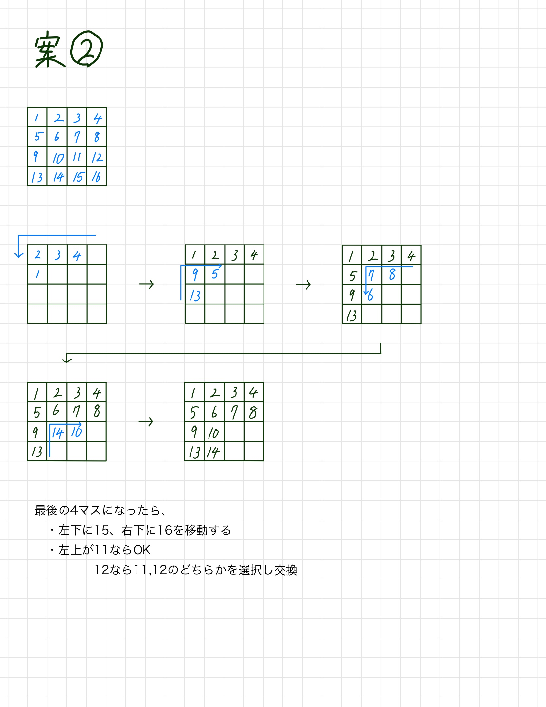
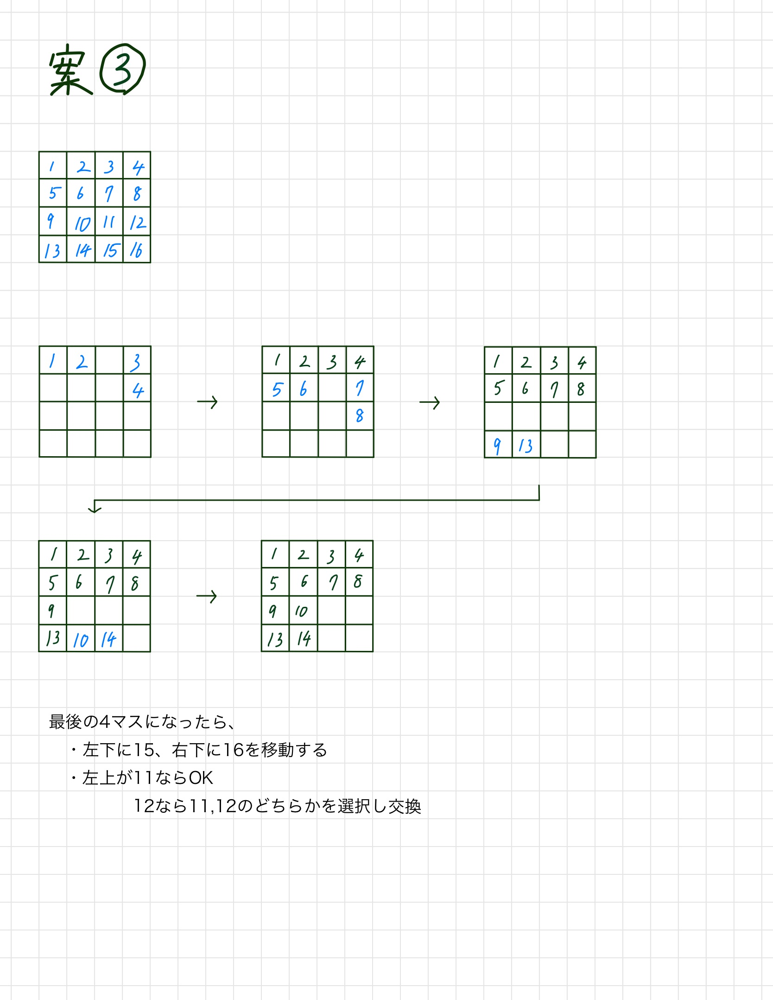
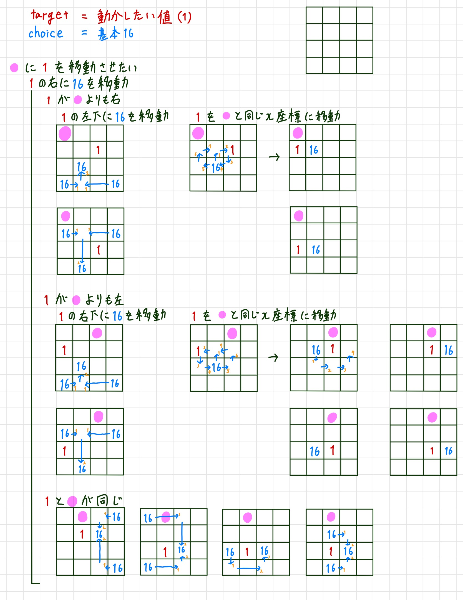
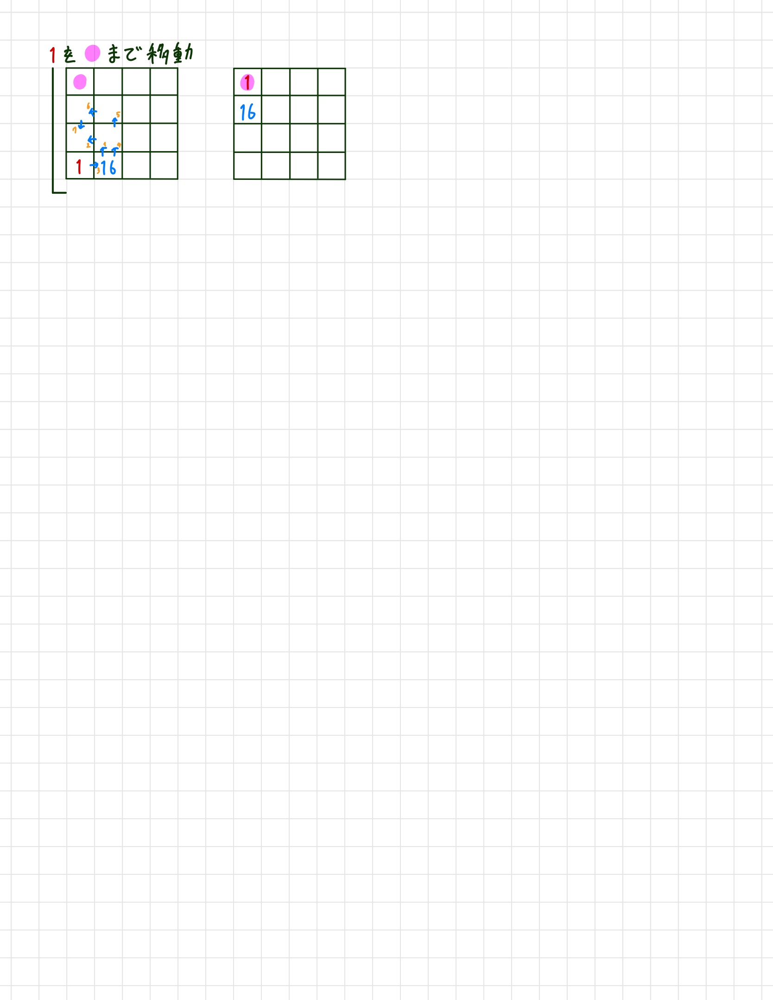

# joboji_campus

テーマ:画像処理

## 4/28
githubの設定  
clone,commit,pushできたことを確認  

## 5/12
選択回数 : 16パズルなら2回  
受け取りフォーマット : 配列?

## 並べ替え案
1. 

2. 

~~こっちの方がいい気がする~~

3. 

これ!!!!!!!!!!!!!!!!!!!!!!!!!!!!!!!!!!!!!!!!!!!!!!!!!!!!!  

## restore.ipynb
~~4x4の配列で座標を所得するだけ~~  
~~選択した値を座標移動させたい値の上まで移動させる(途中)~~  
選択した値(16)を上下左右に動かす関数  
最後の2行値を除く、動かしたい値が下端にあるとき以外の移動はできた  

* 移動方法

## slide_puzzle.ipynb
新しいファイルで作り直す  

### to do
* up, down, right, leftの関数が 4x4 にしか対応してない
* 変数名のリファクタリング
* txtの行数、列数を反映させる

